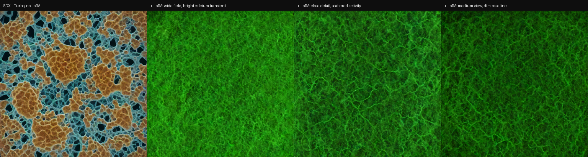

# duc_organoid — Brain Organoid LoRA (SDXL)

A style LoRA that renders **two-photon calcium-imaging microscopy of human brain
organoids**: green calcium-indicator fluorescence on black, fine filamentous
neurites, granular photon noise.

Trained on real recordings, not on stock "neuron art". The base model's idea of a
neuron is an orange illustrated network; this replaces it with what the microscope
actually produces.

By **Iason Paterakis** and **Nefeli Manoudaki** · [Metaesthetica](https://metaesthetica.xyz/)
Source microscopy: **Ken Kosik Neurobiology Lab, UC Santa Barbara**



---

## Download

**[⬇ duc_organoid_sdxlbase_v1.safetensors](https://github.com/Patterson1080/duc-brain-organoid-lora/releases/download/v1.0/duc_organoid_sdxlbase_v1.safetensors)**
(81.5 MB) — or grab it from the [Releases page](https://github.com/Patterson1080/duc-brain-organoid-lora/releases/latest).

The weights are a release asset rather than a file in the repo, so cloning won't
include them — download the file above.

---

## Quick start

| | |
|---|---|
| **Base model** | **SDXL** — works on SDXL base 1.0 and SDXL-Turbo. **Not SD 1.5, not SD 2.x.** |
| **File** | `duc_organoid_sdxlbase_v1.safetensors` (81.5 MB) — see [Download](#download) |
| **Trigger** | `duc_organoid` |
| **Weight** | **0.8** (0.5 subtle · 1.0 strong) |
| **Trained at** | 1024×1024 (works well 768–1024) |
| **Network** | LoRA, rank 16 / alpha 16, UNet only |

**Prompt:**

```
duc_organoid, wide field, bright calcium transient
```

That's it. `duc_organoid` is an invented token — nothing else activates it, and
nothing else is needed.

---

## Prompt vocabulary

The LoRA was trained on exactly this caption grammar:

```
duc_organoid, <scene>, <state>
```

| slot | values |
|---|---|
| **trigger** | `duc_organoid` |
| **scene** | `wide field` · `medium view` · `close detail` |
| **state** | `dim baseline` · `scattered activity` · `bright calcium transient` |

Any combination of the nine works. Examples:

```
duc_organoid, close detail, bright calcium transient
duc_organoid, wide field, dim baseline
duc_organoid, medium view, scattered activity
```

### Why you should NOT describe the look

There is deliberately **no** "green", "fluorescence", "microscopy", "black
background" or "two-photon" in any training caption. Those traits are bound to the
`duc_organoid` token itself.

Consequence: the trigger alone carries the entire aesthetic. Adding descriptive
words does not strengthen it — it spends prompt weight on concepts the base model
interprets its own way, and can actively fight the LoRA. Keep prompts short.

You can still steer composition with unrelated terms (`aerial view`, `dense`,
`sparse`), but the look itself comes from the token.

---

## Using it

### ComfyUI

1. Drop the `.safetensors` into `ComfyUI/models/loras/`.
2. Load an **SDXL** checkpoint (SDXL base 1.0 or SDXL-Turbo).
3. Add **Load LoRA** between checkpoint and sampler. Set **strength_model 0.8**.
   Strength_clip has no effect — this is a UNet-only LoRA.
4. Positive prompt: `duc_organoid, wide field, bright calcium transient`

Sampler settings: SDXL base → 25–30 steps, CFG 5–7. SDXL-Turbo → 1–4 steps, CFG 0–1.

### A1111 / Forge / SD.Next

1. Put the file in `models/Lora/`.
2. Select an **SDXL** checkpoint.
3. Prompt:

```
duc_organoid, wide field, bright calcium transient <lora:duc_organoid_sdxlbase_v1:0.8>
```

### diffusers (Python)

```python
import torch
from diffusers import StableDiffusionXLPipeline

pipe = StableDiffusionXLPipeline.from_pretrained(
    "stabilityai/stable-diffusion-xl-base-1.0",
    torch_dtype=torch.float16, use_safetensors=True,
).to("cuda")

pipe.load_lora_weights("duc_organoid_sdxlbase_v1.safetensors")
pipe.fuse_lora(lora_scale=0.8)

image = pipe(
    "duc_organoid, wide field, bright calcium transient",
    num_inference_steps=30, guidance_scale=6.0,
    width=1024, height=1024,
).images[0]
image.save("organoid.png")
```

For **SDXL-Turbo**, swap the model id and use `num_inference_steps=4,
guidance_scale=0.0`.

Loading prints a harmless warning that no text-encoder keys were found. That is
expected — this is a UNet-only LoRA.

### img2img / real-time (StreamDiffusion, TouchDesigner)

Works as a normal SDXL LoRA. Verified settings:

```yaml
model_id: "stabilityai/sdxl-turbo"
lora_dict:
  "…/duc_organoid_sdxlbase_v1.safetensors": 0.8
width: 768
height: 768
t_index_list: [25]
guidance_scale: 1.0
delta: 1.0
use_tiny_vae: true
```

Two things specific to this setup:

- **The prompt must contain `duc_organoid`.** If you use weighted prompt blending,
  give it real weight — below ~0.3 against a competing concept at 1.0 it will not show.
- **With TensorRT, the LoRA is fused into the engine at build time.** Changing the
  LoRA or its weight requires an engine rebuild, so settle the weight first. Once
  built there is no per-frame cost — a LoRA engine and a non-LoRA engine are the
  same size and speed.

At `t_index_list: [25]` (light denoising) the input's structure is preserved and
the organoid texture grows into it — good for restyling footage. Lower values
denoise more and let the LoRA invent more.

---

## What it does and doesn't do

**Does well**

- Green-on-black calcium-imaging colorimetry, replacing the base model's orange
  illustrated-neuron prior
- Fine filamentous neurite texture with realistic granular photon noise
- Overlaying organoid growth onto unrelated structure in img2img (circuit boards,
  maps, architecture) while preserving the underlying layout

**Does not**

- Generate anatomically meaningful or scientifically accurate organoid morphology.
  **This is an aesthetic tool, not a scientific one.** Do not present its output as
  microscopy data.
- Produce other fluorescence colours. The training set is a narrow green channel;
  asking for red or multi-channel labelling fights the LoRA.
- Work on SD 1.5 or SD 2.x. It is SDXL-only, architecturally.

---

## Training data

160 training images derived from **20 curated frames** drawn from **11 independent
two-photon recordings** of human brain organoids (calcium-transient imaging).

That last number is the honest limitation: **11 distinct fields of view.** Crops,
scale variation and the full dihedral group of rotations/mirrors expand the sample
count, not the diversity. Expect a convincing *texture and palette*, not broad
structural variety. Prompting for unusual compositions will mostly return the base
model's idea of them, tinted.

Preparation, briefly:

- Burned-in scale bars cropped out (not painted over — a black rectangle would
  have been learned as part of the concept)
- Monochrome exports dropped; mixing them into a green set muddies the colour prior
- Per-frame gamma exposure matching (gamma, not gain — gain clipped bright cell
  bodies to flat white)
- Crops at or near 1:1 source pixels rather than downscaling whole frames

---

## Training configuration

| | |
|---|---|
| Trained on | `stabilityai/stable-diffusion-xl-base-1.0` |
| Deployed on | SDXL-Turbo (and SDXL base) |
| Checkpoint | step 350 of 600 |
| Resolution | 1024×1024, no aspect bucketing (all images square) |
| Rank / alpha | 16 / 16 |
| Optimizer | AdamW8bit, LR 1e-4, cosine, 50 warmup |
| Batch | 4 |
| Precision | bf16 |
| `noise_offset` | 0.05 |
| `min_snr_gamma` | 5 |
| Text encoders | not trained |

**Why trained on SDXL base rather than SDXL-Turbo:** an earlier run trained
directly on SDXL-Turbo and produced a broken LoRA — flat grey output at high
denoising strength. SDXL-Turbo is adversarially distilled, and standard LoRA
training optimises the ordinary MSE denoising objective across the full 1000-step
schedule, which is precisely what the model was distilled away from. Training the
undistilled base avoids the conflict; the result loads onto Turbo unchanged.

**If you retrain any Turbo / Lightning / LCM model, train the undistilled base.**

`noise_offset` matters here more than usual: the source frames are very dark
(25–45% of pixels below value 8), and SDXL cannot represent true black without it,
so the LoRA otherwise converges to washed-out grey backgrounds.

---

## Versions

| version | notes |
|---|---|
| **v1.0** | SDXL, trained on SDXL base 1.0, checkpoint step 350 of 600. |

Two earlier experimental builds were not released: an SD 2.1 version (incompatible
with SDXL pipelines) and a build trained directly on SDXL-Turbo, which collapsed —
see *Why trained on SDXL base* above.

---

## Credits

**Source microscopy** — Two-photon calcium-imaging recordings of human brain
organoids, provided by the **Ken Kosik Neurobiology Lab, University of California,
Santa Barbara**.

**LoRA authors** — **Iason Paterakis** and **Nefeli Manoudaki**.

**Owner** — **Metaesthetica** — <https://metaesthetica.xyz/> **Mert Toka**, **Nefeli Manoudaki**, **Iason Paterakis**, **Stejara Iulia Dinulescu**, **prof. Diarmid Flatley**

## License

**CreativeML Open RAIL++-M** (inherited from Stable Diffusion XL 1.0, including its
use-based restrictions) **plus Additional Terms** — see [LICENSE](LICENSE). In short:

- **Attribution required** — credit the authors, Metaesthetica, and the Kosik Lab.
- **Non-commercial** — commercial use needs written permission from Metaesthetica.
- **No scientific misrepresentation** — outputs are synthetic and must not be
  presented as microscopy data or used to illustrate experimental findings.
- **No rights in the training data** — the recordings belong to the Kosik Lab and
  are not distributed here.

The sample image above is pure text-to-image output; it contains no training data.
